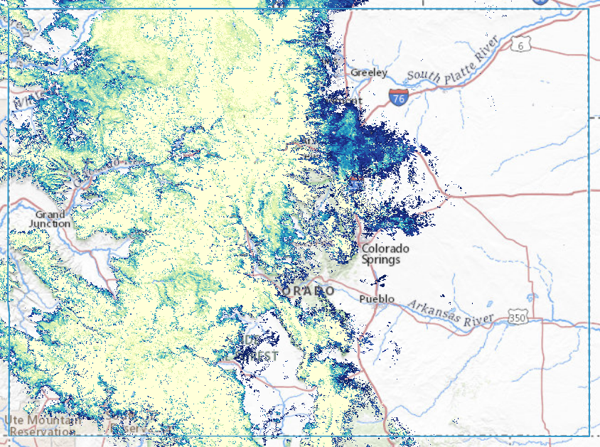

# Snow Today Webapp



Enable users to browse daily snow variables in various regions (South-West US, maybe
eventually High Mountain Asia).

Depends on [Snow Today Webapp Server](https://github.com/nsidc/snow-today-webapp-server)
to function.

**WARNING: This software is currently in early development. Do not expect it to be
easily deployable.**


## Level of Support

This repository is not actively supported by NSIDC but we welcome issue submissions and
pull requests in order to foster community contribution.

See the [LICENSE](LICENSE) for details on permissions and warranties. Please contact
nsidc@nsidc.org for more information.


## Requirements

This package requires either Docker or the NPM environment described by `package.json`.


## Usage

Run from source:
```
docker-compose up --build
```

Deploy latest version from UNPKG (replace `snow-today-webapp` in URLs with
`snow-today-webapp@X.Y.Z` to deploy a specific version):
```
<div id="snow-today-webapp-appcontainer"></div>
...
<link rel="stylesheet"
      href="https://unpkg.com/@nsidc/snow-today-webapp/dist/main.css"
      type="text/css"></style>
<script src="https://unpkg.com/@nsidc/snow-today-webapp"></script>

```


## Troubleshooting

*TODO*


## License

See [LICENSE](LICENSE).

## Code of Conduct

See [Code of Conduct](CODE_OF_CONDUCT.md).

## Credit

This software was developed by the National Snow and Ice Data Center with funding from
multiple sources.
